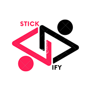
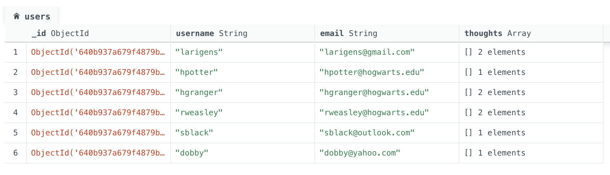
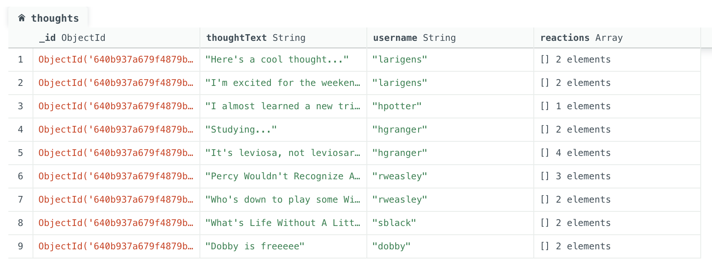
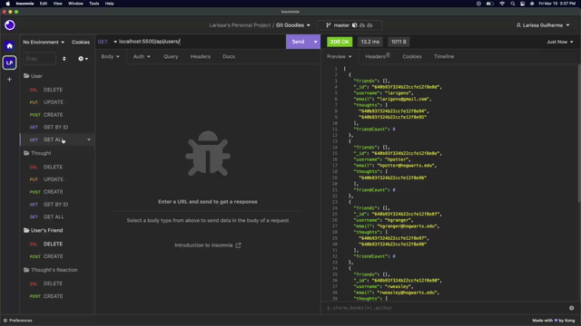
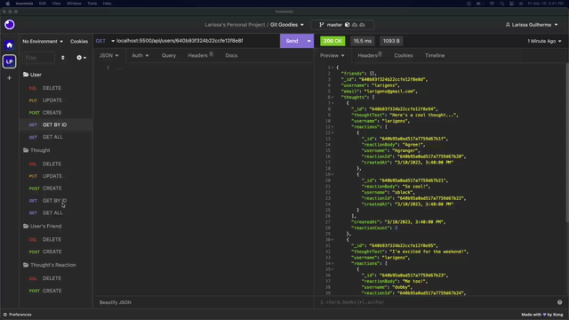
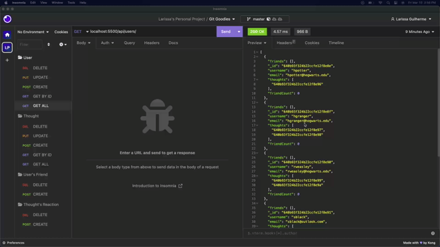

<h1 align="center"> Stickify </h1>

<p align="center">
    
  <br><br>
  <i> Social Network API
    <br> built using Node.js and MongoDB</i>
  <br>
</p>
<br>

<div align="center">


</div>

---

## Description

Stickify is an API for a social network web application that allows users to share their thoughts, react to their friends' thoughts, and create a friend list.

## Table of Contents

- [Description](#description)
- [Table of Contents](#table-of-contents)
- [Installation](#installation)
  - [Cloning the Repository](#cloning-the-repository)
  - [Prerequisites](#prerequisites)
  - [Setting Up](#setting-up)
- [Mock-Up](#mock-up)
- [Usage](#usage)
- [Tests](#tests)
  - [Prerequisites](#prerequisites-1)
  - [Running Tests](#running-tests)
- [Questions](#questions)
- [Contributing](#contributing)
  - [Contributing Guidelines](#contributing-guidelines)
  - [Code of Conduct](#code-of-conduct)
- [Credits](#credits)
  - [Acknowledgements](#acknowledgements)
  - [Links](#links)
- [License](#license)

## Installation

### Cloning the Repository

Click `<> code` - the green button. After clicking, in the local tab, copy the SSH key. Open the terminal in your Macbook or [git bash](https://git-scm.com/downloads), if you have Windows/Linux, and type:

```bash
git clone [paste ssh key]
```

### Prerequisites

This package requires [Node.js](https://nodejs.org/en/download/),[Express.js](https://expressjs.com/), [MongoDB](https://www.npmjs.com/package/mongodb) and [Mongoose](https://www.npmjs.com/package/mongoose).

For `Node.js`

```bash
npm i node@lts
```

For `Express.js`

```bash
npm i express
```

For `MongoDB`

```bash
npm i mongodb
```

For `Mongoose`

```bash
npm i mongoose
```

### Setting Up

Open the project in VS Code and make sure you are in the directory of this application before installing the dependencies. To install it, type the commands below on your terminal:

```bash
npm i
```

Once you run this, npm will begin the installation process of all of the current project's dependencies.

## Mock-Up

The following images are an illustration of the existing collections in the database.





## Usage

Launch the application by entering the command below on your terminal:

```bash
npm start
```

You can use this API to build your own social network web application where users can share their thoughts, react to friends’ thoughts, and create a friend list.

This API provides endpoints to create, read, update, and delete users and thoughts. You can also create and delete reactions to thoughts and add and remove friends to a user’s friend list.

If you need more guidance on how to use Stickify, click [here]() for the tutorial!

## Tests

### Prerequisites

To test this application, you will need to install [Postman API](https://www.postman.com/downloads/) or [Insomnia](https://insomnia.rest/download).

### Running Tests

The following animation shows the application's **GET** routes to return all users, and all thoughts being tested in Insomnia:



The following animation shows the application's **GET** routes to return a single user and a single thought being tested in Insomnia:



The following animation shows the application's **POST, PUT, and DELETE** routes for users being tested in Insomnia:


The following animation shows the application's **POST, PUT, and DELETE** routes for thoughts being tested in Insomnia:


The following animation shows the application's **POST and DELETE** routes for user's friend list being tested in Insomnia:



The following animation shows the application's **POST and DELETE** routes for thought's reactions being tested in Insomnia:


## Questions

For questions and support feel free to contact me via:

<a href="mailto:larigens@gmail.com">📧 Email </a>

<a href="https://github.com/larigens">🐈‍⬛ GitHub </a>

## Contributing

### Contributing Guidelines

Want to report a bug, contribute some code, request a new feature, or improve the documentation? You can submit an issue and I will gladly welcome you as a contributor, but before submitting an issue, please search the issue tracker, as it may already exist!

### Code of Conduct

Our Code of Conduct follows the same principles as the [Contributor Covenant](https://www.contributor-covenant.org/version/2/1/code_of_conduct/), version 2.1.

## Credits

### Acknowledgements

- [W3 Schools](https://www.w3schools.com)
- [MDN](https://developer.mozilla.org/en-US/)
- [Node.js](https://nodejs.org/en/)
- [NPM](https://www.npmjs.com/)
- [README Lab](https://github.com/larigens/readme-lab)
- [Express.js](https://expressjs.com/en/4x/api.html)
- [Stack Overflow](https://stackoverflow.com/)
- [dotenv](https://www.npmjs.com/package/dotenv)
- [Postman API](https://www.postman.com/)
- [Insomnia](https://insomnia.rest/)
- [MongoDB](https://www.mongodb.com/docs/manual/tutorial/getting-started/)
- [Mongo Compass](https://www.mongodb.com/products/compass)
- [Mongoose](https://mongoosejs.com/docs/guide.html)

### Links

[](https://lari-gui.herokuapp.com/)
[](https://www.linkedin.com/in/lari-gui/)
[](https://twitter.com/coffeebr_eak)

## License

Please refer to the [LICENSE](https://choosealicense.com/licenses/apache-2.0/) in the repo.
